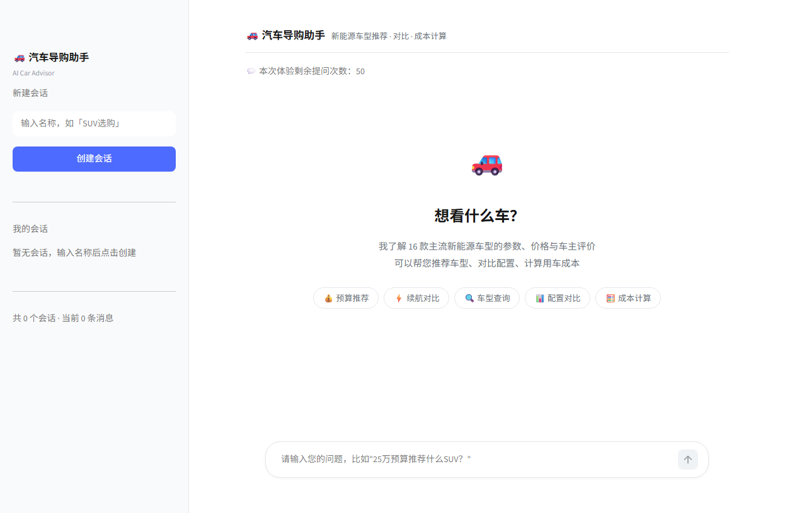
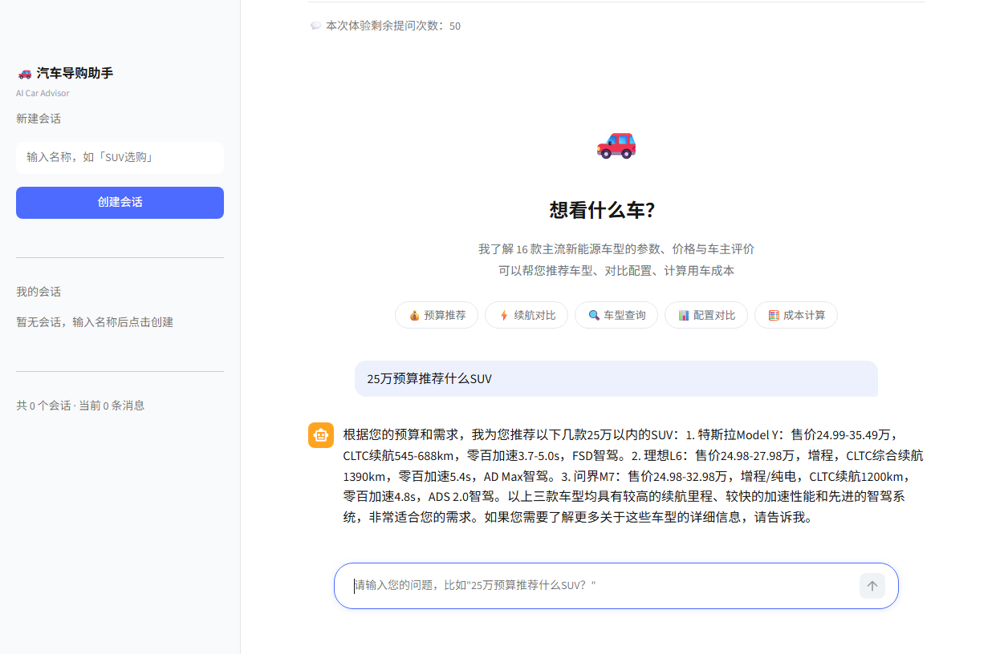
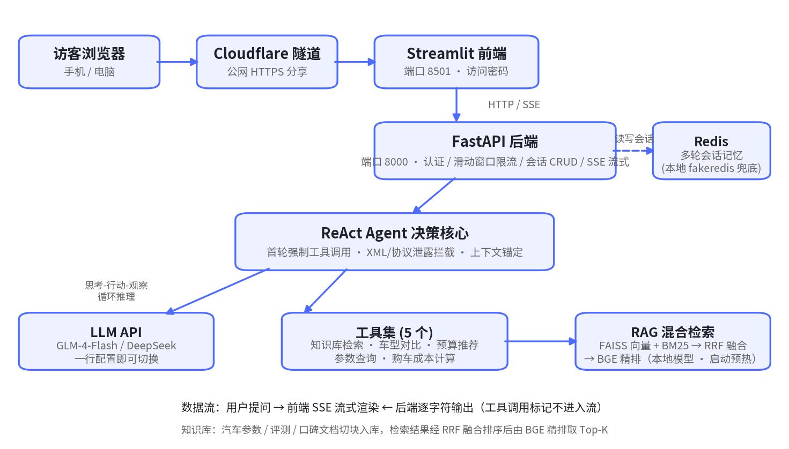

# 汽车导购 AI 问答助手

基于 **ReAct Agent + RAG 混合检索** 的汽车导购问答系统：用户用自然语言描述预算和需求，Agent 自主调用知识库检索、车型对比、预算推荐、成本计算等工具，以流式方式给出有数据支撑的购车建议。

> 个人独立完成的求职作品，方向：**AI Agent 开发工程师**。线上体验 / 合作交流欢迎联系。

<p align="center">
  
  
  
  
  
</p>

## 界面预览

<p align="center">
  
  
</p>

## 核心亮点

**1. 工程化解决「工具调用协议泄露」问题**
ReAct 模式下大模型会输出 `<tool_call>...` 等 XML/DSML 标记，直接流式透传会污染前端。本项目在 Agent 层做**非流式拦截 + 字符级清洗**后再转发 SSE 流，从架构上根除泄露，并用 25 组对抗用例（截断标记、嵌套标签、跨 chunk 拆分等）做回归验证。

**2. 上下文锚定，解决多轮对话「答非所问」**
用户回复"需要 / 好的"这类短消息时，传统拼接历史的方式容易让模型跑偏。通过识别上一轮结尾的提议（如"要不要帮你算落地价？"）+ 客套话过滤 + 澄清分支，把短回复锚定到具体待办动作上，显著降低答非所问率。

**3. 混合检索 + 模型本地化，兼顾精度与冷启动**
FAISS 向量检索与 BM25 关键词检索经 RRF 融合排序，再由 BGE Reranker 精排取 Top-K；嵌入/精排模型全部本地化并在服务启动时预热，首问延迟从约 40s 降到 8s，后端就绪时间约 2.5s。

**4. 首轮强制工具调用，杜绝模型编造参数**
首轮 `tool_choice=required` 强制 Agent 先查知识库再回答，配合车名四级模糊解析（全称→别名→拼音→模糊匹配），参数类回答均有出处，避免幻觉。

**5. 完整的生产化细节**
Redis 会话记忆（无 Redis 时 fakeredis 本地兜底）、会话增删查改、滑动窗口限流、JWT + API Key 双认证、访问密码门禁、Cloudflare 隧道一键公网分享。

**6. 测试驱动验收**
八轮真实场景回归：多轮指代消解、协议泄露对抗、会话 CRUD（17 项断言）、公网访客流程（8 项断言）等，验收记录见 `tmp_xmlcheck/REPORT.md`。

## 系统架构

<p align="center">
  
</p>

## 技术栈

| 分层 | 技术选型 |
| --- | --- |
| LLM 应用 | ReAct Agent（自实现思考-行动-观察循环）、Function Calling、SSE 流式输出 |
| LLM 服务 | 智谱 GLM-4-Flash（默认，免费额度）/ DeepSeek（一行配置切换） |
| 检索 | FAISS、BM25、RRF 融合、BGE Reranker 精排（模型本地化 + 启动预热） |
| 后端 | FastAPI、Uvicorn、Redis / fakeredis、JWT、滑动窗口限流 |
| 前端 | Streamlit（会话管理、流式渲染、访问密码门禁） |
| 部署 | Cloudflare 隧道公网分享、Windows 一键启动脚本 |

## 快速开始

```bash
# 1. 克隆并安装依赖
git clone https://github.com/1934896060lxawd-sketch/agent.git
cd agent
pip install -r requirements.txt

# 2. 下载检索模型到 models/ 目录
#    models/bge-base-zh-v1.5  与  models/bge-reranker-base
#    （HuggingFace 搜索同名模型即可）

# 3. 配置环境变量
cp .env.example .env   # 然后填入你的 LLM_API_KEY

# 4. 启动（两个终端）
uvicorn backend.main:app --host 0.0.0.0 --port 8000
streamlit run frontend/app.py --server.port 8501
```

Windows 用户也可以直接双击 `start_all.bat` 一键启动。打开 http://localhost:8501 即可开始问答。

## 项目结构

```
├── backend/            # FastAPI 后端
│   ├── agent/          # ReAct 循环、协议拦截、上下文锚定、5 个业务工具
│   ├── api/            # 路由与依赖注入（会话 CRUD、SSE 问答接口）
│   ├── core/           # 会话管理、安全认证、限流、流式输出
│   └── rag/            # 切块入库、FAISS+BM25 混合检索、BGE 精排
├── frontend/           # Streamlit 前端（会话管理 + 流式渲染）
├── knowledge_base/     # 汽车知识库原始文档与索引产物
├── models/             # 本地化嵌入/精排模型（不入库）
├── docs/               # 架构、API、部署、RAG 设计文档
└── tmp_xmlcheck/       # 端到端测试与验收记录
```

## 文档与测试

- 设计与运维文档：[架构设计](docs/ARCHITECTURE.md) · [RAG 设计](docs/RAG_DESIGN.md) · [API 说明](docs/API.md) · [部署指南](docs/DEPLOY.md) · [公网访问](docs/public-access.md)
- 测试基建：`tmp_xmlcheck/` 下的 `e2e_live_test.py`（多轮对话端到端）、`stub_and_test_strip.py`（25 组协议泄露对抗用例）、`test_session_crud.py`（17 项断言）、`test_visitor_flow.py`（公网访客流程 8 项断言）
- 完整开发过程记录（11 天开发计划）：[docs/DEV_PLAN.md](docs/DEV_PLAN.md)

## 作者

**罗小安** — 2026 届应届本科毕业生，求职方向：AI Agent 开发工程师（意向城市：深圳）。
本项目为个人独立作品，从需求分析、架构设计到测试验收全流程完成。

如有问题或建议，欢迎通过 Issue 交流。
